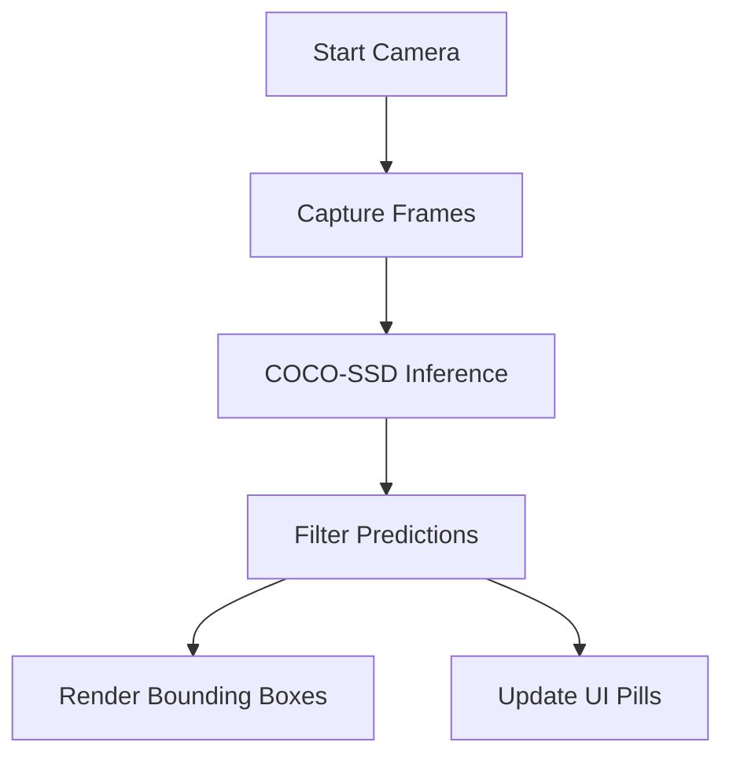

# VisionX — Real-Time AI Object Detection

**Detect anything. Instantly. In real-time.**


[Live Demo: https://visionnx.vercel.app](https://visionnx.vercel.app)

## About

VisionX is a high-performance, real-time object detection web application. Powered by TensorFlow.js and the pre-trained COCO-SSD model, it identifies 80 object classes directly in your browser. VisionX delivers smooth, hardware-accelerated WebGL computer vision locally, requiring zero backend servers.

## Features
- ✅ **Real-Time Detection**: Processes live webcam feeds to detect objects instantaneously.
- ✅ **80 Object Classes**: Identifies everyday items, animals, and vehicles with high accuracy.
- ✅ **Client-Side Inference**: Runs AI processing entirely in-browser via TensorFlow.js for total privacy.
- ✅ **Interactive Controls**: Adjusts confidence thresholds and maximum object limits dynamically.
- ✅ **FPS Monitoring**: Tracks frames-per-second to monitor live inference performance.
- ✅ **Snapshot Capture**: Saves video frames with bounding boxes directly to your device.
- ✅ **Clean Minimal UI**: Uses a modern, dark-themed interface built with vanilla HTML/CSS.

## ⚙️ How It Works



1. **Media Access**: Secures live video feeds via the browser's native `getUserMedia` API.
2. **WebGL Inference**: Feeds continuous video frames into the COCO-SSD model using GPU-accelerated WebGL.
3. **Threshold Filtering**: Discards weak predictions falling below your dynamic confidence slider threshold.
4. **Canvas Overlay**: Maps raw coordinates to responsive bounding boxes drawn instantly via HTML5 Canvas.
5. **UI Synchronization**: Updates the detected objects list and calculates live frames-per-second metrics.

## Detectable Objects
VisionX can detect the following 80 COCO classes:

- **People**: Detects persons directly within the frame.
- **Vehicles**: Identifies bicycles, cars, motorcycles, airplanes, buses, trains, trucks, and boats.
- **Animals**: Recognizes birds, cats, dogs, horses, sheep, cows, elephants, bears, zebras, and giraffes.
- **Sports**: Tracks frisbees, skis, snowboards, sports balls, kites, bats, gloves, skateboards, surfboards, and rackets.
- **Food**: Spots bottles, wine glasses, cups, forks, knives, spoons, bowls, fruits, vegetables, and common meals.
- **Furniture**: Locates chairs, couches, potted plants, beds, dining tables, toilets, sinks, and vases.
- **Electronics**: Finds TVs, laptops, mice, remotes, keyboards, cell phones, microwaves, ovens, toasters, and refrigerators.
- **Other**: Identifies backpacks, umbrellas, handbags, ties, suitcases, books, clocks, scissors, teddy bears, and toothbrushes.

## Tech Stack
- **HTML5**: Structure and Semantic Layout
- **CSS3**: Custom Minimal Styling, Flexbox, Animations
- **JavaScript (Vanilla)**: Application Logic, Media Capture, Canvas Rendering
- **TensorFlow.js**: Web-based Machine Learning Framework
- **COCO-SSD**: Pre-trained Object Detection Model

## How to Run

1. Clone the repository:
```bash
git clone https://github.com/poovarasu638178-rgb/codealpha_tasks.git
cd codealpha_tasks/Task1_VisionX
```

2. Start a local server:
```bash
python3 -m http.server 8080
```

3. Open your browser and navigate to:
```
http://localhost:8080
```

## Project Structure
```text
CodeAlpha_VisionX/
├── index.html     # Main application layout and UI
├── style.css      # Minimal dark-theme styling
├── script.js      # TensorFlow.js logic and UI interactions
├── favicon.png    # App icon and logo
└── README.md      # Project documentation
```

## Author
Built by **Poovarasu S**
- GitHub: [poovarasu638178-rgb](https://github.com/poovarasu638178-rgb)
- Internship: CodeAlpha AI Internship 2026
- Student ID: CA/DF1/126353

## License
This project is licensed under the MIT License.

---
⭐ *If you found this project helpful or interesting, please consider starring the repository!*
